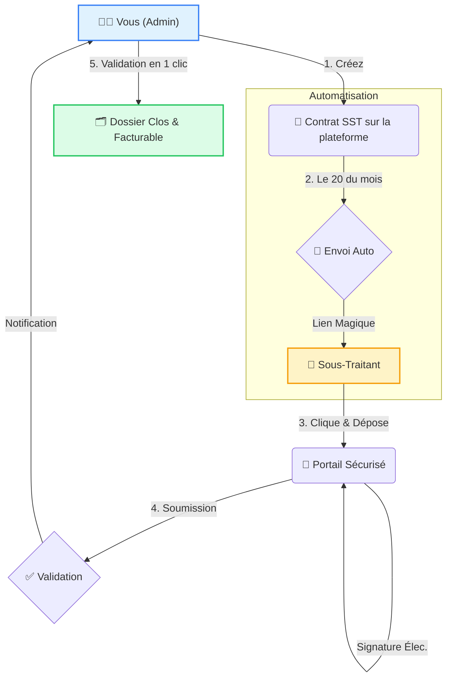
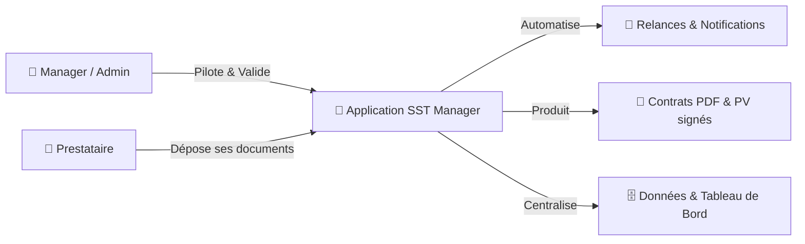
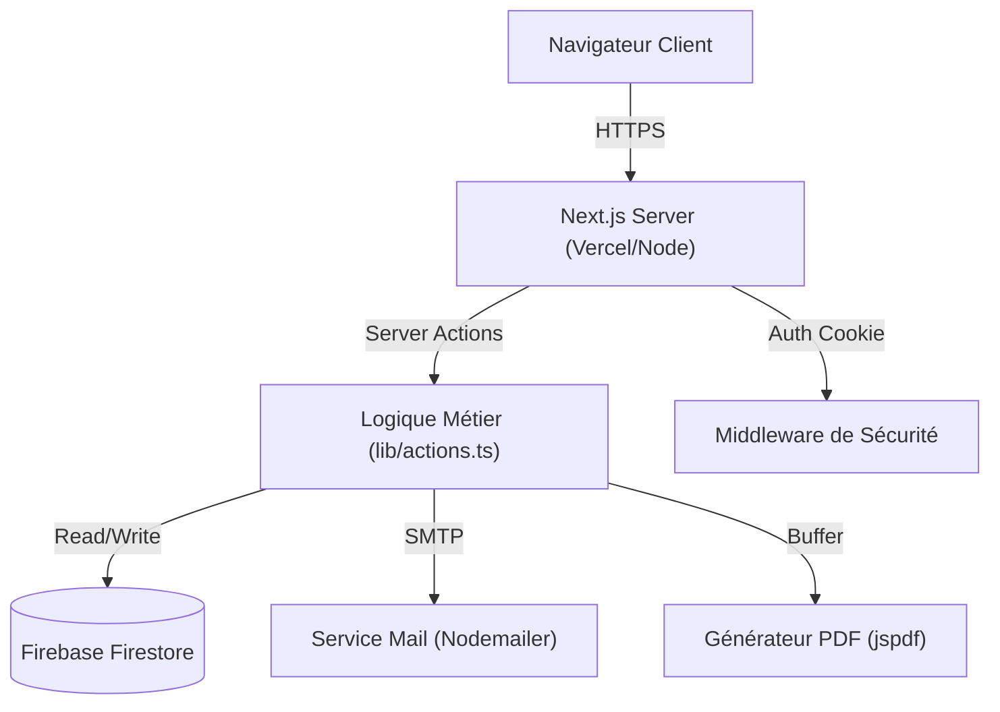

# 🚀 Gestion Centralisée des Sous-Traitants

Bienvenue sur **plateforme de Gestion Centralisée des Sous-Traitants**, votre tour de contrôle pour gérer les contrats de sous-traitance, automatiser les tâches administratives et suivre votre rentabilité en temps réel.

---

## 📊 Comment ça marche ? (Le Flux Magique)

Plus besoin de courir après les documents. Laissez le système travailler pour vous.

---

## ✨ Fonctionnalités Clés

### 1. 📢 Campagnes d'Emails Automatisées
Fini les copier-coller.
*   Le système détecte tous les contrats actifs.
*   Il génère un **"Lien Magique"** unique pour chaque sous-traitant.
*   Il envoie un email personnalisé invitant à déposer les documents (BL/PV).

### 2. 🔐 Portail Sous-Traitant (Sans Mot de Passe)
Vos sous-traitants n'ont rien à installer, ni mot de passe à retenir.
*   Ils cliquent sur le lien dans l'email.
*   Ils arrivent sur leur espace personnel.
*   Ils remplissent leurs jours, **signent électroniquement** sur l'écran (PC ou Mobile) et valident.

### 3. 🛡️ Tableau de Bord & Validation
Vous gardez le contrôle total.
*   **KPIs en temps réel** : Voyez tout de suite qui est à jour et qui est en retard.
*   **Notifications** : Recevez un email dès qu'un document est soumis.
*   **Validation en Masse** : Validez 10, 20 ou 50 documents d'un coup grâce aux cases à cocher.

### 4. 💰 Suivi Financier
*   **Marge Nette** : Calculez automatiquement la différence entre votre prix de vente client et le coût du sous-traitant.
*   **Reste à Faire (RAF)** : Anticipez votre chiffre d'affaires des prochains mois.

---

## 🛠️ Guide Rapide

### Pour Démarrer le Mois
1.  Allez dans l'onglet **Livrables**.
2.  Cliquez sur **"Générer les Livrables"**. Le système prépare les coquilles vides pour le mois en cours.

### Pour Lancer la Collecte
1.  Allez dans l'onglet **SST**.
2.  Cliquez sur **"Lancer Campagne"**.
3.  C'est tout ! Les emails partent.

### Pour Valider
1.  Surveillez l'indicateur **"Documents à Valider"** sur l'accueil.
2.  Cliquez dessus pour voir la liste.
3.  Vérifiez, sélectionnez, et cliquez sur **"Tout Valider"**.

---

## 🏗️ Architecture du Projet (Pour les curieux)

Pour faire tourner cette machine, nous utilisons une architecture moderne et robuste, mais simple à comprendre :

1.  **Le Visage (Frontend)** : `Next.js 14` & `React`.
    *   C'est ce que vous voyez à l'écran. C'est rapide, fluide et adaptatif (PC/Mobile).
2.  **La Mémoire (Base de Données)** : `Firebase Firestore`.
    *   C'est là où sont stockés les contrats, les livrables et les signatures. Pas de serveur compliqué à gérer, tout est dans le cloud sécurisé de Google.
3.  **Le Facteur (Emails)** : `Nodemailer`.
    *   C'est le système qui livre les messages et les rappels directement dans la boîte mail des sous-traitants.
4.  **Le Style (Design)** : `Tailwind CSS`.

---

## 📂 Visite Guidée (Où trouver quoi ?)

Si vous devez mettre les mains dans le moteur, voici le plan des lieux :

*   **`app/`** : C'est ici que vivent les pages du site.
    *   `page.tsx` : La page d'accueil (Dashboard).
    *   `contracts/`, `sst/`, `deliverables/` : Les pages correspondant aux onglets du menu.
    *   `portal/` : La zone secrète (et publique) pour les sous-traitants.
*   **`lib/`** : Le cerveau de l'opération.
    *   `actions.ts` : Toutes les fonctions "serveur" (créer un contrat, valider un document, envoyer un mail).
    *   `firebase.ts` : La connexion à la base de données.
    *   `mail.ts` : La configuration pour l'envoi d'emails.
    *   `pdf-generator.ts` : L'usine à PDF.
*   **`components/`** : Les briques LEGO.
    *   Boutons, tableaux, formulaires... réutilisés un peu partout.
*   **`types/`** : Le dictionnaire.
    *   Définit à quoi ressemble un "Contrat" ou un "SST" pour que le code ne se perde pas.

---

# Documentation Technique du Projet

## 🧠 Vue Fonctionnelle (Pour Product Owner / Métier)
Ce schéma illustre **qui fait quoi** et **ce que produit le système**, sans jargon technique.

## 🏗 Architecture Technique (Pour l'équipe Dév)
Le projet repose sur une architecture **Fullstack Next.js 16** (App Router), hébergée en Serverless.

### ⚙️ Comment ça marche (Cycle de vie d'une requête)
Pour les développeurs, le flux typique est le suivant :

1.  **Client (Interaction)** : L'utilisateur clique sur un bouton (ex: "Valider le BL").
2.  **Server Action** : Une fonction backend (`lib/actions.ts`) est invoquée directement.
3.  **Traitements** :
    - La fonction vérifie la session (Middleware/Cookie).
    - Elle modifie la donnée dans **Firestore**.
    - Elle peut déclencher un service annexe (Email, PDF).
4.  **Retour UI** : Le serveur commande au client de rafraîchir la donnée (`revalidatePath`), l'interface se met à jour instantanément.

---

## 🎨 Partie Frontend (Interface)
L'interface est construite en **React** avec **Tailwind CSS**.

- **Server Components (RSC)** : Toutes les pages (`app/page.tsx`, `app/contracts/page.tsx`) sont rendues sur le serveur. Elles récupèrent les données directement (sans `useEffect`) pour une vitesse maximale.
- **Client Components** : Utilisés uniquement pour l'interactivité (Boutons, Formulaires). Ils sont marqués par `"use client"`.
- **UI Kit** : Une bibliothèque de composants maison (`components/ui`) stylisée avec Tailwind pour une identité visuelle "Premium" (Couleurs Deep Blue).

---

## ⚙️ Partie Backend (Logique)
Le "Backend" n'est pas une API séparée (pas de Node.js/Express classique). Il est intégré directement dans Next.js via les **Server Actions**.

- **Server Actions** (`lib/actions.ts`) : Ce sont des fonctions asynchrones qui s'exécutent côté serveur mais qu'on appelle depuis le frontend comme des fonctions classiques. C'est ici que réside toute la logique métier (Création de contrat, Validation, Envoi email).
- **Base de Données** : **Firebase Firestore** (NoSQL). Données structurées en collections (`sst`, `contracts`, `deliverables`).
- **Emails** : **Nodemailer**. Configuré pour utiliser un SMTP externe ou le mode Simulation (Offline) si dev.
- **PDF** : **jsPDF** & **jspdf-autotable**. Génération programmatique des documents (BL/PV) côté serveur pour garantir leur intégrité.

---

## 🔒 Sécurité & Authentification
- **Middleware** (`middleware.ts`) : Intercepte chaque requête. Vérifie la présence d'un cookie de session sécurisé (`HttpOnly`).
- **Protection** : Si pas de cookie -> Redirection forcée vers `/login`.
- **Session** : Gérée via un système de cookie signé (pas de JWT complexe pour l'instant, simple et efficace).

---

## 🚀 Stack Technique Résumé
| Couche | Technologie | Rôle |
| :--- | :--- | :--- |
| **Framework** | Next.js 16 (App Router) | Structure Fullstack |
| **Langage** | TypeScript | Typage fort & Sécurité |
| **Styles** | Tailwind CSS | Design System |
| **Base de Données** | Firestore (Firebase) | Stockage Données |
| **Emails** | Nodemailer | Notifications |
| **PDF** | jsPDF | Génération Documents |
