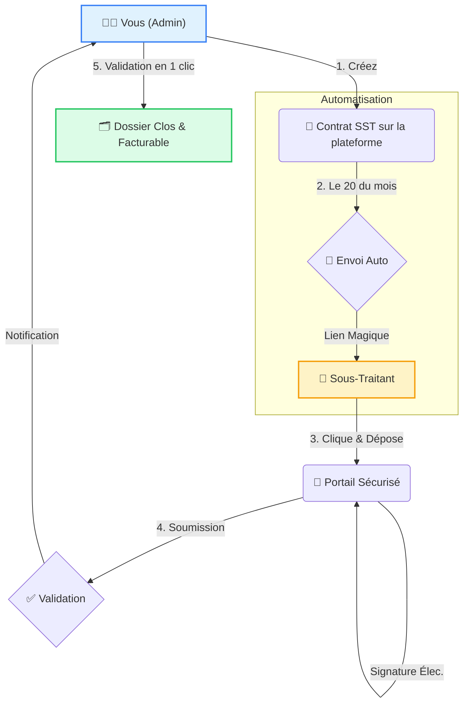

# 🚀 Gestion Centralisée des Sous-Traitants

Bienvenue sur **plateforme de Gestion Centralisée des Sous-Traitants**, votre tour de contrôle pour gérer les contrats de sous-traitance, automatiser les tâches administratives et suivre votre rentabilité en temps réel.

---

## 📊 Comment ça marche ? (Le Flux Magique)

Plus besoin de courir après les documents. Laissez le système travailler pour vous.

---

## ✨ Fonctionnalités Clés

### 1. 📢 Campagnes d'Emails Automatisées
Fini les copier-coller.
*   Le système détecte tous les contrats actifs.
*   Il génère un **"Lien Magique"** unique pour chaque sous-traitant.
*   Il envoie un email personnalisé invitant à déposer les documents (BL/PV).

### 2. 🔐 Portail Sous-Traitant (Sans Mot de Passe)
Vos sous-traitants n'ont rien à installer, ni mot de passe à retenir.
*   Ils cliquent sur le lien dans l'email.
*   Ils arrivent sur leur espace personnel.
*   Ils remplissent leurs jours, **signent électroniquement** sur l'écran (PC ou Mobile) et valident.

### 3. 🛡️ Tableau de Bord & Validation
Vous gardez le contrôle total.
*   **KPIs en temps réel** : Voyez tout de suite qui est à jour et qui est en retard.
*   **Notifications** : Recevez un email dès qu'un document est soumis.
*   **Validation en Masse** : Validez 10, 20 ou 50 documents d'un coup grâce aux cases à cocher.

### 4. 💰 Suivi Financier
*   **Marge Nette** : Calculez automatiquement la différence entre votre prix de vente client et le coût du sous-traitant.
*   **Reste à Faire (RAF)** : Anticipez votre chiffre d'affaires des prochains mois.

---

## 🛠️ Guide Rapide

### Pour Démarrer le Mois
1.  Allez dans l'onglet **Livrables**.
2.  Cliquez sur **"Générer les Livrables"**. Le système prépare les coquilles vides pour le mois en cours.

### Pour Lancer la Collecte
1.  Allez dans l'onglet **SST**.
2.  Cliquez sur **"Lancer Campagne"**.
3.  C'est tout ! Les emails partent.

### Pour Valider
1.  Surveillez l'indicateur **"Documents à Valider"** sur l'accueil.
2.  Cliquez dessus pour voir la liste.
3.  Vérifiez, sélectionnez, et cliquez sur **"Tout Valider"**.

---

## 🏗️ Architecture du Projet (Pour les curieux)

Pour faire tourner cette machine, nous utilisons une architecture moderne et robuste, mais simple à comprendre :

1.  **Le Visage (Frontend)** : `Next.js 14` & `React`.
    *   C'est ce que vous voyez à l'écran. C'est rapide, fluide et adaptatif (PC/Mobile).
2.  **La Mémoire (Base de Données)** : `Firebase Firestore`.
    *   C'est là où sont stockés les contrats, les livrables et les signatures. Pas de serveur compliqué à gérer, tout est dans le cloud sécurisé de Google.
3.  **Le Facteur (Emails)** : `Nodemailer`.
    *   C'est le système qui livre les messages et les rappels directement dans la boîte mail des sous-traitants.
4.  **Le Style (Design)** : `Tailwind CSS`.
    *   Pour que ce soit beau, propre et agréable à utiliser au quotidien.
